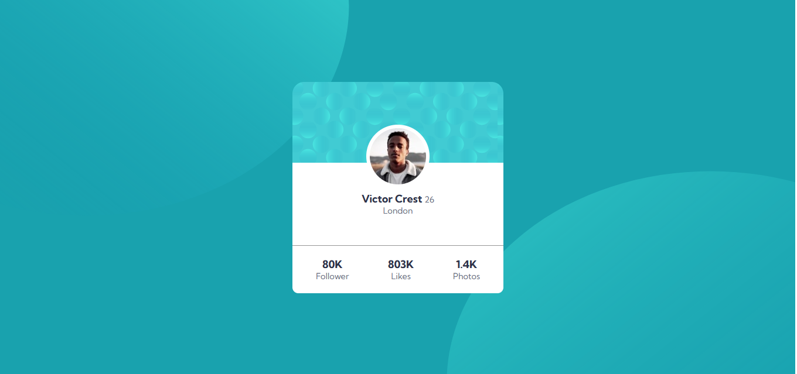

## Overview

### The challenge

- Build out the project to the designs provided

### Screenshot

## My process
### Built with

- Semantic HTML5 markup
- CSS custom properties
- Flexbox
- CSS Grid
- Mobile-first workflow

### What I learned
In this challenge , i haven't learnt new stuff but this challenge helps me in brushing up my skill.

### Continued development
From first challenge , i'm more focusing on responsive design . Learning more about grid and flexbox and their implementation.

## Author
- Frontend Mentor - [@amandeep2603](https://www.frontendmentor.io/profile/amandeep2603)
